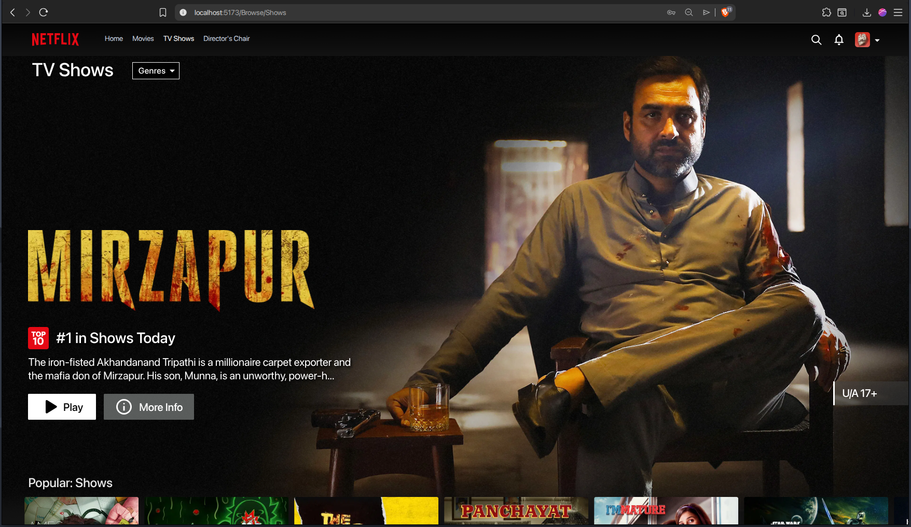

A UI focused Netflix Clone built using react + vite using firebase for authentication and storage, TMDB API for content/resource and data, and YouTube for background banner video preview.

  

### Check the visual walkthrough video [here](https://jumpshare.com/share/hcza9xOUFwxT61EhDoKd)
# React + Vite

This template provides a minimal setup to get React working in Vite with HMR and some ESLint rules.

Currently, two official plugins are available:

- [@vitejs/plugin-react](https://github.com/vitejs/vite-plugin-react/blob/main/packages/plugin-react/README.md) uses [Babel](https://babeljs.io/) for Fast Refresh
- [@vitejs/plugin-react-swc](https://github.com/vitejs/vite-plugin-react-swc) uses [SWC](https://swc.rs/) for Fast Refresh
